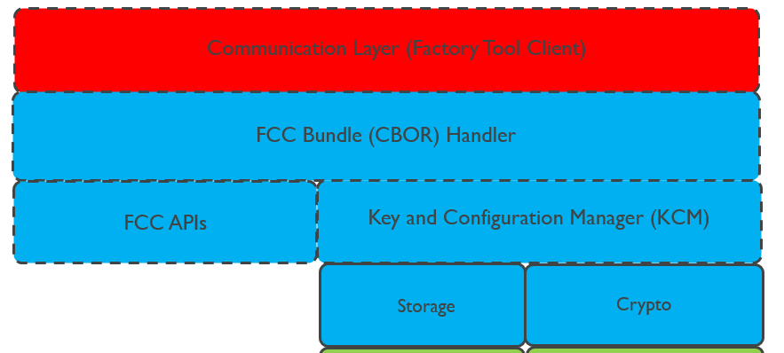
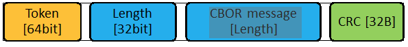
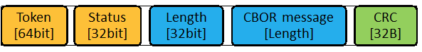

# Factory Client Configurator (FCC) and Key Configuration Manager (KCM) modules overview

## Overview

This document is a high-level overview of Factory Client major modules. It includes a brief functionality description of each module, mentions relevant source code files and lists external APIs that could be invoked by external user.  
The modules are: Communication, FCC Bundle Handler, FCC, KCM, Storage and Crypto.  

Below, is a high-level diagram of the mentioned modules:
 
  
 

## Communication 

The module receives and processes transport layer incoming packet which is transferred from the Factory Tool to the device. It also creates a response packet that is sent back to the Factory Tool.  

The format of the incoming packet is:  

 
The format of the response packet is:  

 
where:  
TOKEN (64 bit)  -  Unique number agreed by the Factory Tool and Factory Client.  
STATUS (32 bit) - The Status of the Factory Tool to Factory Client message.  
LENGTH (32 bit) - The message length in bytes.  
MESSAGE (LENGTH bytes) - The message raw bytes. The message is in CBOR format.  
MESSAGE CRC (32B) - hash SHA256 of the CBOR message 

Two interfaces are supported: Serial and TCP over Ethernet. 
 
The relevant source code files are:  
`ftcd_comm_base.cpp`  -  common for TCP over Ethernet and Serial Interface  
`ftcd_comm_serial.cpp` - implementation of serial interface  
`ftcd_comm_socket.cpp` - implementation of TCP over Ethernet interface  

The layer serves for demo/example purposes only!
 
## FCC Bundle Handler 

This layer as a part of FCC core.  
It processes the bundle (in CBOR format) which is created by the Factory Client Utility (FCU) and transferred to the device by the Factory Tool. The device creates a response CBOR message with status and warning details and sends it back to the Factory Tool and the FCU.  
(e.g.:  the MESSAGE field in the transport response packet is in CBOR format as described in Communication section).  

CBOR message contains keys, certificates and configuration parameters that should be injected to the device.  

The relevant source code files are:  
`fcc_bundle_handler.c` - This is the main file. It gets CBOR encoded message and processes it. It also encodes response message to CBOR format before it is sent to the transport layer.  
`fcc_bundle_common_utils.c` - helper function that parses the CBOR blob  
`fcc_bundle_config_params_utils.c` - The file extracts data parameters for each config param from CBOR blob  
`fcc_bundle_key_utils.c` - The file extracts data parameters for each key from CBOR blob  
`fcc_bundle_certificate_utils.c` - The file extracts data parameters for each certificate from CBOR blob  

The following API is external and could be invoked by user application:

  - `fcc_status_e  fcc_bundle_handler(const uint8_t *encoded_blob, size_t encoded_blob_size, uint8_t **bundle_response_out, size_t *bundle_response_size_out);`

## Factory Client Configurator (FCC)

This layer as a part of FCC core.  
This module has several APIs which invoke the following flows:  
  -   Initiation and finalization of FCC module. 
  -   After items injection: verification that the device is ready for mbed cloud connection 
  -   Retrieving errors and warnings during injection process.
  -   Developer mode - The purpose of this mode is to make developing with FCC easier by removing the need to use the factory configurator utility (FCU). 
  -   Cleaning all data that was injected to the device

The relevant source code files are:  
`factory_configurator_client.c` - the main file that implements the mentioned above functionalities.  

APIs located in the below files are called from `factory_configurator_client.c`:  
`fcc_output_info_handler.c` - Retrieving errors and warnings during injection process.  
`fcc_verification.c` - Verification that the device is ready for mbed cloud connection  
`fcc_dev_flow.c` - developer flow implementation 

The following API is external and could be invoked by user application:

 - `fcc_status_e fcc_init(void);`  
 - `fcc_status_e fcc_finalize(void);`  
 - `fcc_status_e fcc_storage_delete(void);`  
 - `fcc_output_info_s* fcc_get_error_and_warning_data(void);`  
 - `fc_status_e fcc_verify_device_configured_4mbed_cloud(void);`  
 - `fcc_status_e fcc_developer_flow(void);`  

## Key and Configuration Manager (KCM)

This layer as a part of KCM core.  
This module stores parameters, keys and certificates (items) in the device's secure storage and allows other applications (customer or mbed) to access these parameters.  
 
Store APIs can be called in the following scenarios:
 - by the FCC Bundle Handler layer, after the items are extracted from CBOR.
 - by the FCC layer in developer flow. Pre-generated items, located in mbed_cloud_dev_credentials.c are injected into the device.
 - Directly by external user

The module allows the following operations on items: 
 - verification and storing item into a secure storage.
 - retrieve item data size from a secure storage
 - retrieve item data from a secure storage
 - delete item from a secure storage

In addition, the module provides the following services:
 - initialization and finalization of file storage resources
 - resetting KCM secure storage to factory state.

The relevant source code file is:  
`key_config_manager.c`  -  implements the mentioned above functionalities.  

The following API is external and could be invoked by user application:

 - `kcm_status_e kcm_init(void);`
 - `kcm_status_e kcm_finalize(void);`
 - `kcm_status_e kcm_item_store(const uint8_t *kcm_item_name, size_t kcm_item_name_len, kcm_item_type_e kcm_item_type, bool kcm_item_is_factory, const uint8_t *kcm_item_data, size_t kcm_item_data_size, const kcm_security_desc_s security_desc);`  
 - `kcm_status_e kcm_item_get_data_size(const uint8_t *kcm_item_name, size_t kcm_item_name_len, kcm_item_type_e kcm_item_type, size_t *kcm_item_data_size_out);`
 - `kcm_status_e kcm_item_get_data(const uint8_t *kcm_item_name, size_t kcm_item_name_len, kcm_item_type_e kcm_item_type, uint8_t *kcm_item_data_out, size_t kcm_item_data_max_size, size_t * kcm_item_data_act_size_out);`  
 - `kcm_status_e kcm_item_get_data (const uint8_t *kcm_item_name, size_t kcm_item_name_len, kcm_item_type_e kcm_item_type);`  
 - `kcm_status_e kcm_factory_reset(void);`  

## Storage 

This layer is a part of KCM core.  
This is an internal module which serves as an intermediate layer between KCM and the ESFS.  It is accessed by KCM only and calls ESFS APIs. All FCC and KCM storage related operations are using this layer. 

The module allows the following operations:
 - Initialization of storage, so it can be used
 - finalization of storage to close all storage resources
 - reset storage to an empty state
 - storage factory reset
 - write files to storage
 - get file size 
 - read files from storage
 - delete files from storage

The relevant source code file is:  
`storage.c`  -  implements the mentioned above functionalities.

## Crypto 

This layer is a part of KCM core.  
This is an internal module which serves as an intermediate layer between KCM and the PAL Crypto layer. The module provides Crypto services for KCM layer. Its APIs invoked by KCM module and calls PAL Crypto APIs.  

For keys, the module checks following properties:  
 - parsing and verification of ECC keys.
For certificates, the module checks following properties:
 - verification that the x509 certificate is in valid DER format
 - common certificate validations

Common property:  
 - Implementations of Crypto Algorithms using PAL Crypto APIs

The relevant source code files are:  
`cs_der_keys.c` - keys parsing and verification  
`cs_der_certs.c` - certificates parsing and verification  
`cs_hash.c` - hash calculation  

